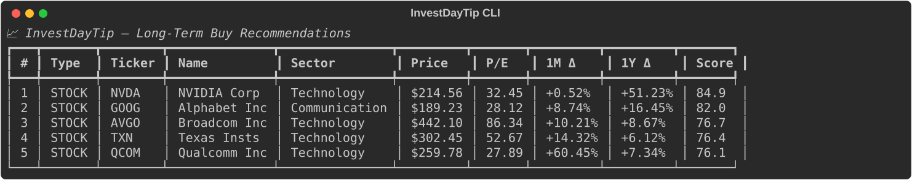

# InvestDayTip

<p align="center">
  
</p>

> A multi-factor analysis tool that suggests long-term **stock & ETF** buy recommendations from US, European, Asian, and Superinvestor-consensus markets, computed live from public market data.

[](LICENSE)
[](https://www.python.org/downloads/)
[](https://pypi.org/project/investdaytip/)
[](https://github.com/dfdezdom/investdaytip/actions/workflows/ci.yml)
[](https://github.com/dfdezdom/investdaytip/stargazers)
[](https://github.com/dfdezdom/investdaytip/commits/main)

---

## Features

- 📈 **Multi-factor scoring** — composite 0-100 score per asset
- 🏦 **Stocks & ETFs** — auto-detected and scored with dedicated models
- 🌍 **US, European, Asian & Superinvestor markets** — S&P 500, DAX, CAC 40, FTSE 100, Nikkei 225, Hang Seng, NSE, and superinvestor consensus picks from DataRoma 13F filings
- 💱 **Currency filter** — narrow by native currency (`USD`, `EUR`, `JPY`, …)
- ⚡ **Concurrent fetching** — analyzes ~300 tickers in seconds
- 📊 **Rich CLI output** — price, 1M/1Y change, score breakdown and rationale
- 🧾 **Self-contained HTML export** — interactive report with filters and sortable columns
- 🧪 **Pure scoring functions** — testable without network
- 🧠 **Interactive advisor** — market pulse, portfolio review, and tailored buy recommendations via the `advisor` subcommand
- 🤖 **AI-powered advisor** — chat with an intelligent investment advisor that analyzes markets, reviews portfolios, and recommends buys — powered by [OpenCode](https://opencode.ai) agents

---

## Installation

### From PyPI (recommended)

```bash
pip install investdaytip
```

### Upgrade

```bash
pip install --upgrade investdaytip
```

Force reinstall if the version doesn't update (e.g. cached old wheel):

```bash
pip install --upgrade --no-cache-dir investdaytip
```

### From source (for development)

```bash
git clone https://github.com/dfdezdom/investdaytip.git
cd investdaytip
python -m venv .venv
source .venv/bin/activate          # Windows: .venv\Scripts\activate
pip install -e ".[dev]"
```

---

## Quick start

```bash
pip install investdaytip
investdaytip
```

That's it. You'll see the top 5 buys scored across 300+ stocks & ETFs.

<p align="center">
  
</p>

---

## Usage

### CLI

```bash
investdaytip                         # Top 5 from full universe (US + EU + Asia, stocks + ETFs)
investdaytip -n 10                   # Top 10
investdaytip -a stocks               # Only stocks
investdaytip -a etfs                 # Only ETFs
investdaytip -r us                   # Only US
investdaytip -r eu                   # Only Europe
investdaytip -r asia                 # Only Asia
investdaytip -r superinvestor        # Only superinvestor consensus tickers
investdaytip -r us eu                # US + Europe
investdaytip -r eu -a stocks         # Only European stocks
investdaytip -r asia -a etfs         # Only Asian ETFs
investdaytip -c USD                  # Only USD-denominated assets
investdaytip -c EUR                  # Only EUR-denominated assets
investdaytip -c USD EUR              # USD + EUR assets
investdaytip -c JPY                  # Only JPY-denominated assets
investdaytip -r eu -c USD            # EU region + USD post-filter
investdaytip -r us eu -c USD EUR     # US + EU, USD + EUR assets
investdaytip -t AAPL MSFT VOO        # Custom ticker list

investdaytip --tickers-file tickers.txt # Custom ticker file (lines, spaces, commas)
investdaytip --tickers-file tickers-files-examples/semiconductors_relevant_tickers.txt
investdaytip --export-html report.html # Export report with interactive filters
investdaytip --export-html             # Uses investDayTip-aaaammdd-hhmm.html
                                       # or investDayTip-<tag>-aaaammdd-hhmm.html
                                       # when --tickers-file is set

investdaytip --superinvestor         # Fetch DataRoma superinvestor data and display column
investdaytip --min-market-cap 1B     # Raise min market cap to $1B
investdaytip --min-market-cap 0      # Disable market-cap filter

investdaytip --no-cache              # Bypass SQLite cache, fetch fresh data
investdaytip --cache-clear           # Purge all cached data before running
investdaytip --workers 20            # More parallelism

investdaytip --help

./preview.sh                         # Serve generated HTML files on localhost:8000
```

#### Options

| Flag | Description | Default |
|---|---|---|
| `-n, --top N` | Number of recommendations | `5` |
| `-t, --tickers ...` | Custom ticker list (overrides universe) | curated universe |
| `--tickers-file PATH` | Text file with custom tickers (merged with `--tickers` if both are used) | disabled |
| `-a, --asset-class {all,stocks,etfs}` | Asset class filter | `all` |
| `-r, --region {all,us,eu,asia,superinvestor}` `nargs="+"` | Region filter(s) — e.g. `-r us eu` | `all` |
| `-c, --currency {all,USD,EUR,GBP,…}` `nargs="+"` | Currency filter(s); narrows universe to matching regions when no `-r` is given | `all` |
| `-s, --sector TEXT` | Sector/category prefix filter, case-insensitive (e.g. `Financial` matches Financial Services) | disabled |
| `--export-html [PATH]` | Export recommendations to self-contained HTML (`investDayTip-aaaammdd-hhmm.html` if omitted) | disabled |
| `--superinvestor` | Include superinvestor ownership data from DataRoma (adds ~80 HTTP requests, shows column in HTML and CLI) | disabled |
| `--min-market-cap VALUE` | Minimum market cap (`1B`, `500M`, `0` to disable) | `2B` |
| `--no-cache` | Skip SQLite cache, fetch all data live from Yahoo Finance | disabled |
| `--cache-clear` | Purge the SQLite cache before running | disabled |
| `--workers N` | Parallel fetch threads | `10` |
| `-h, --help` | Show the CLI help message and exit | n/a |

### Advisor subcommand

Interactive market analysis with **multi-indicator macro pulse** (VIX, 10Y-2Y yield curve, MOVE bond volatility, DXY dollar strength), portfolio review, and buy recommendations:

```bash
investdaytip advisor                          # Interactive mode (asks for risk, region, etc.)
investdaytip advisor --risk moderate          # Non-interactive with risk preset
investdaytip advisor --risk aggressive -r us -a stocks    # US stocks, aggressive, non-interactive
investdaytip advisor --risk moderate --portfolio portfolios/portfolio.txt  # Custom portfolio
```

The advisor now displays a **composite macro health score** (0-100) alongside VIX:
- 🟢 **≥70** — Macro healthy
- 🟡 **≥45** — Mixed signals
- 🟠 **≥25** — Macro warning
- 🔴 **<25** — Macro danger

See `investdaytip advisor --help` for all options.

#### Market Indicators

The advisor fetches six live indicators to compute the composite **macro health score** (0-100):

| Indicator | Ticker | What it measures | Reference ranges | Score impact |
|---|---|---|---|---|
| **VIX** | `^VIX` | Expected S&P 500 volatility over the next 30 days | ≤15 calm, ≤25 neutral, ≤35 fear, >35 panic | ±20 |
| **VXN** | `^VXN` | Expected Nasdaq 100 volatility (tech-heavy complement to VIX) | (informational only) | — |
| **10Y-2Y Spread** | `^TNX` + `2YY=F` | US Treasury yield curve slope — inverted curve signals recession risk | >1% healthy, 0–1% neutral, <0% inverted | −20 / +5 |
| **MOVE** | `^MOVE` | Bond market volatility (Merrill Lynch Option Volatility Estimate) | <60 calm, 60–100 normal, 100–120 elevated, >120 panic | −15 / +5 |
| **DXY** | `DX-Y.NYB` | US Dollar Index — strength against EUR, JPY, GBP, CAD, SEK, CHF | <95 weak, 95–100 neutral, 100–105 strong, >105 very strong | −10 / +5 |
| **Fear & Greed** | [CNN API](https://production.dataviz.cnn.io/index/fearandgreed/graphdata) | Composite market sentiment from 7 sub-indicators (momentum, breadth, put/call, volatility, junk bonds, safe havens) | 0–100; <25 extreme fear, >75 extreme greed | ±10 (contrarian) |

The score starts at a neutral **50** and each indicator adjusts it up or down based on current readings. The final score determines the macro signal:

- 🟢 **≥70** — Macro healthy → **buy**
- 🟡 **≥45** — Mixed signals → **hold**
- 🟠 **≥25** — Macro warning → **hold**
- 🔴 **<25** — Macro danger → **sell**

All indicators are shown live in the `📈 Market Analysis` table when running `investdaytip advisor`.

### OpenCode AI Agent

> 🤖 Chat with an AI investment advisor that checks VIX, reviews portfolios, and recommends buys — see [`.opencode/agents/advisor.md`](.opencode/agents/advisor.md).

No memorizing flags. From the project root:

```text
@advisor  what's the market pulse?
```

### HTML export

Generate an interactive report that works offline (single file with inline CSS/JS):

```bash
investdaytip -n 25 -a all -r all --export-html investdaytip-report.html
```

The generated report includes filters for:

- Text search (ticker/name/sector)
- Asset class (`stock` / `etf`)
- Region (`us` / `eu` / `asia` / `superinvestor`)
- Minimum score
- Minimum 1M return (%)
- Minimum 1Y return (%)

When `--superinvestor` is enabled, an additional **"Superinvestors"** sortable column appears between 1Y and Score showing the number of tracked managers holding each ticker.

It also includes:

- Click-to-sort columns (ascending/descending)
- Full-width responsive layout (uses available browser width)
- Pre-rendered rows + client-side interactivity (works even if JS is restricted)
- Direct platform links in table columns: `Ticker` (Google Finance), `T` (TradingView), `Y` (Yahoo Finance)

Direct platform links (`Ticker` → Google Finance, `T` → TradingView, `Y` → Yahoo Finance) use exchange suffix mapping. See `_normalize_exchange_hint()` and `_exchange_mapping()` in [`src/investdaytip/html_export.py`](src/investdaytip/html_export.py) for the full list of ~20 supported exchanges.

### Programmatic API

```python
from investdaytip import get_recommendations

# Get top 5 Asian stocks
picks = get_recommendations(top_n=5, region="asia", asset_class="stocks")
for s in picks:
    print(f"{s.data.ticker} ({s.asset_type}) — score={s.total:.1f}")
    print(f"  Price: {s.data.current_price} {s.data.currency}")
    print(f"  1M: {s.data.return_1m:.2%}  1Y: {s.data.return_12m:.2%}")
    print(f"  Why: {'; '.join(s.rationale[:3])}")

# Or filter by sector (prefix match, case-insensitive)
picks = get_recommendations(top_n=5, sector="Financial")  # Financial + Financial Services

# Or mix regions and asset classes
picks = get_recommendations(top_n=10, region="all")  # US + EU + Asia stocks & ETFs
```

---

## Output

Each recommendation includes:

| Column | Meaning |
|---|---|
| **Type** | `STOCK` or `ETF` |
| **Ticker / Name / Sector** | Identification |
| **Ticker link** | Opens Google Finance in a new tab |
| **T / Y** | Opens TradingView / Yahoo Finance in a new tab |
| **Price** | Current price in native currency |
| **% Today** | Daily change vs previous close |
| **P/E** | Trailing price-to-earnings ratio (stocks; `-` when unavailable) |
| **1M Δ** | % change vs ~22 trading days ago |
| **1Y Δ** | % change vs ~252 trading days ago |
| **Superinvestors** | Number of managers holding the stock (HTML only; `-` if not in DataRoma universe) |
| **Score** | Composite 0-100 weighted score |
| **Breakdown** | Four sub-scores (shown in a compact single line) |
| **Why** | Top 3 rationale notes |

---

## Scoring Model

Each metric is normalized to **0-100** via piecewise-linear functions over empirically reasonable ranges. Missing data contributes a neutral **50** so a ticker isn't penalized for lacking a metric.

### Stocks (Graham/Buffett + Momentum)

| Pillar | Weight | Metrics |
|---|---|---|
| **Quality** | 35% | ROE, profit margin, earnings & revenue growth |
| **Value** | 25% | trailing P/E, P/B, PEG |
| **Health** | 20% | Debt/Equity, current ratio, free cash flow |
| **Trend** | 20% | price vs SMA200, 12-month return, SMA200 slope |

### ETFs

| Pillar | Weight | Metrics |
|---|---|---|
| **Returns** | 40% | 3y avg, 5y avg, 12m return |
| **RiskAdj** | 25% | Sharpe proxy `(r12 - rf) / σ`, annualized volatility |
| **Size** | 15% | AUM (log scale) |
| **Cost/Yield** | 20% | expense ratio (lower=better), dividend yield |

---

## Universes

When no `-t` is given, InvestDayTip uses curated universes:

- **US stocks** — 58 large-caps across all S&P sectors (`src/investdaytip/universe.py`)
- **US ETFs** — 41 broad-market, factor, sector and bond ETFs (`etf_universe.py`)
- **EU stocks** — 65 large-caps from DAX, CAC, FTSE 100, IBEX, AEX, SMI, FTSE MIB, Nordics (`eu_universe.py`)
- **EU UCITS ETFs** — 38 broad, sector and bond UCITS ETFs (`eu_etf_universe.py`)
- **Asia stocks** — 76 large-caps from Japan, Hong Kong, Singapore, India, South Korea, Taiwan, and Australia (`asia_universe.py`)
- **Asia ETFs** — 20 broad-market, country-specific, and sector ETFs with significant Asian exposure (`asia_etf_universe.py`)
- **Superinvestor stocks** — 116 consensus picks held by ≥2 of ~82 top investors tracked by DataRoma 13F filings (`superinvestor_universe.py`)

Tickers use Yahoo Finance suffixes: 
- **US:** no suffix (AAPL, MSFT)
- **EU:** `.DE` Xetra · `.PA` Paris · `.AS` Amsterdam · `.L` London · `.MC` Madrid · `.MI` Milan · `.SW` Swiss
- **Asia:** `.T` Tokyo · `.HK` Hong Kong · `.SI` Singapore · `.NS` NSE India · `.KS` Korea · `.TW` Taiwan · `.AX` Australia

### Ticker File Examples

The repository includes ready-to-use ticker sets in `tickers-files-examples/` for thematic analyses:

- `artificial_intelligence_relevant_tickers.txt`
- `biotech_relevant_tickers.txt`
- `energy_relevant_tickers.txt`
- `eu_etfs_relevant_tickers.txt`
- `financial_relevant_tickers.txt`
- `health_relevant_tickers.txt`
- `pharma_relevant_tickers.txt`
- `quantum_computing_relevant_tickers.txt`
- `semiconductors_relevant_tickers.txt`
- `space_relevant_tickers.txt`
- `spain_relevant_tickers.txt`
- `technology_relevant_tickers.txt`

Example:

```bash
investdaytip -n 15 --tickers-file tickers-files-examples/artificial_intelligence_relevant_tickers.txt --export-html
```

After export, preview the generated file in a browser by running:

```bash
./preview.sh
```

Then open the generated report from:

```text
http://localhost:8000/<generated-file-name>.html
```

### Shell tab completion

Autocomplete flags, subcommands, and option values with `TAB`:

```bash
# Enable for the current session:
eval "$(register-python-argcomplete investdaytip)"

# Make it permanent (add to ~/.zshrc or ~/.bashrc):
echo 'eval "$(register-python-argcomplete investdaytip)"' >> ~/.zshrc
```

Once enabled, try `investdaytip -<TAB>` or `investdaytip --region <TAB>`.

---

## Data Source

All market data is fetched live from **Yahoo Finance** via the [`yfinance`](https://github.com/ranaroussi/yfinance) library. Fundamentals come from `Ticker.info`, prices and trend metrics from `Ticker.history(period="2y")`.

**Superinvestor data** is scraped from **DataRoma** (https://www.dataroma.com) — 13F filings from ~82 legendary investors. The data is fetched once and cached for 7 days. Use `--superinvestor` to enable this data and display the "Superinvestors" column in both the HTML report and the CLI table (disabled by default to avoid the ~80 HTTP requests).

### Local Cache

InvestDayTip includes an **SQLite cache** (`~/.investdaytip/cache.db`) created automatically on first fetch:

| Data | TTL |
|------|-----|
| Prices & history | 15 minutes |
| Fundamentals (info dict) | 1 day |
| Superinvestor holdings | 7 days |

The cache uses per-thread SQLite connections with a write lock to support concurrent fetches safely. Use `--no-cache` to bypass the cache for a single run, or `--cache-clear` to purge all entries. Caching is automatically disabled when running tests.

---

## Project Structure

```
preview.sh                # Local static server for generated HTML reports
src/investdaytip/
├── __init__.py            # Public API: get_recommendations
├── main.py                # CLI entry point + rich table rendering
├── advisor.py             # Interactive advisor: market pulse (VIX + macro), portfolio review, buy recs
├── dataroma.py            # DataRoma superinvestor holdings scraper
├── html_export.py         # Self-contained HTML report exporter
├── recommender.py         # Concurrent orchestration
├── cache.py               # SQLite caching layer (per-thread connections, WAL mode)
├── data_source.py         # yfinance wrapper + dataclasses (StockData / EtfData)
├── scoring.py             # Pure scoring functions (score_stock, score_etf)
├── universe.py            # US stock universe
├── etf_universe.py        # US ETF universe
├── superinvestor_universe.py  # Superinvestor consensus universe (DataRoma 13F)
├── eu_universe.py         # EU stock universe
├── eu_etf_universe.py     # EU UCITS ETF universe
├── asia_universe.py       # Asia stock universe
└── asia_etf_universe.py   # Asia ETF universe
portfolios/               # Portfolio ticker files
advisor_recommendations/   # Advisor-generated HTML reports (git-ignored)
tests/
├── test_advisor.py        # Advisor tests (VIX, macro regime, bubble risk)
├── test_main.py           # CLI helper tests
├── test_html_export.py    # HTML export tests
├── test_scoring.py        # Stock scoring tests
└── test_etf_scoring.py    # ETF scoring tests
tickers-files-examples/
├── semiconductors_relevant_tickers.txt
├── artificial_intelligence_relevant_tickers.txt
├── quantum_computing_relevant_tickers.txt
├── energy_relevant_tickers.txt
├── space_relevant_tickers.txt
├── technology_relevant_tickers.txt
├── spanish_relevant_tickers.txt
├── pharma_relevant_tickers.txt
├── biotech_relevant_tickers.txt
├── health_relevant_tickers.txt
└── financial_relevant_tickers.txt
```

---

## Limitations & Caveats

- **No currency normalization** — prices, market caps and AUM stay in native currency
- **Currency filter** (`-c`) compares against yfinance's reported currency field; tickers with a missing/unknown currency are always kept (a missing field shouldn't silently drop a candidate)
- **`min_market_cap` filter** (`--min-market-cap`) is applied against raw native-currency figures; when active, tickers with a missing market cap are excluded
- Some European tickers change Yahoo symbols over time; if a ticker is delisted in Yahoo it's silently skipped
- ETF expense ratios are sometimes missing in `yfinance` — the scorer falls back to a slightly optimistic default (60) in that case
- **Long-term, fundamental-driven model**: not suitable for short-term/day trading signals

---

## Testing

```bash
pip install -e ".[dev]"   # pytest, ruff, mypy
pytest -q                 # run the suite
ruff check src tests      # lint
mypy                      # type-check
```

The scoring engine is purely functional and tested without network calls; an
autouse guard in `tests/conftest.py` fails fast if a test reaches yfinance
unmocked.

---

## Contributing

Contributions are welcome! See [CONTRIBUTING.md](CONTRIBUTING.md).

---

## Disclaimer

**This is not financial advice.** InvestDayTip is an educational tool that applies a deterministic scoring model to publicly available data. Always do your own research and consult a licensed advisor before making investment decisions.

---

## License

[MIT](LICENSE)
